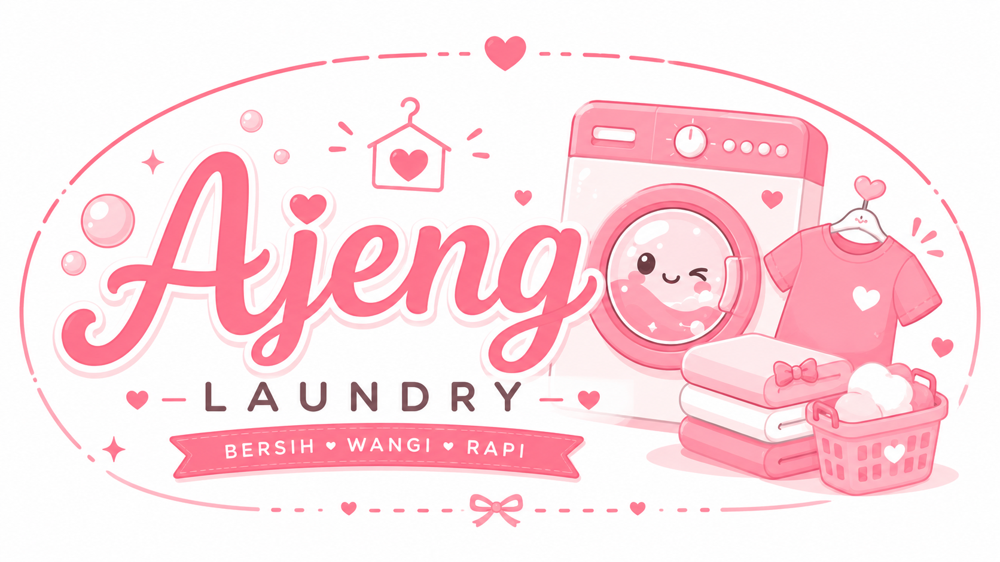
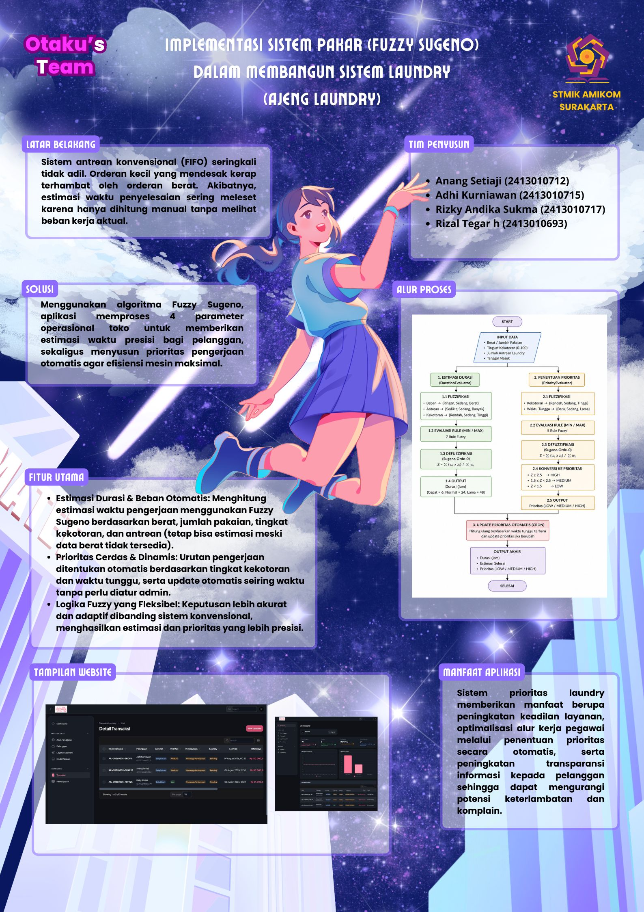

# 24g_laravel_sipakar_laundry

<!-- BANNER PROJECT -->
<p align="center">
  
</p>

<p align="center">
  <strong>Sistem Informasi & Pakar Manajemen Laundry Berbasis Web (Laravel)</strong>
</p>

---

## 📌 Tentang Project

**Sipakar Laundry** adalah sistem informasi manajemen dan sistem pakar berbasis web yang dirancang untuk mengoptimalkan operasional usaha laundry, pencatatan transaksi, dan pengolahan data pelanggan.

---

## 👥 Tim Penyusun

| NIM            | Nama Mahasiswa       |
| :------------- | :------------------- |
| **2413010717** | Rizky Andika Sukma   |
| **2413010712** | Anang Setiaji        |
| **2413010715** | Adhi Kurniawan       |
| **2413010693** | Rizal Tegar Hermawan |

---

## 🚀 Fitur Utama

- [x] Manajemen Transaksi & Order Laundry
- [x] Manajemen Data Pelanggan & Layanan
- [x] Sistem Pakar (Estimasi & Prioritas Laundry)
- [x] Laporan & Riwayat Operasional

---

## 🛠️ Cara Instalasi & Menjalankan Local

1. **Clone Repository**
    ```bash
    git clone https://github.com/kampusriset/24g_laravel_sipakar_laundry.git
    cd 24g_laravel_sipakar_laundry
    ```
2. **Install Dependensi PHP & Node.js**
    ```bash
    composer install
    npm install
    ```
3. **IKonfigurasi Environment**
    ```bash
    cp .env.example .env
    php artisan key:generate
    ```
4. **Migrasi Database & Seeder**
    ```bash
    php artisan migrate --seed
    ```
5. **Jalankan Aplikasi**
    ```bash
    npm run dev
    php artisan serve
    ```

#### Untuk memahami lebih dalam mengenai arsitektur, database, dan cara kerja sistem pakar pada aplikasi ini, silakan baca dokumentasi berikut:

- [📖 Logika Sistem Pakar (Fuzzy Logic)](documentation/01_logika_sistem_pakar.md)
- [🏗️ Arsitektur & Pola Kode](documentation/02_arsitektur_dan_kode.md)
- [🗄️ Struktur Database (ERD)](documentation/03_struktur_database.md)
- [💻 Panduan Penggunaan Sistem](documentation/04_panduan_penggunaan.md)

## Flyer Ajeng Laundry

<p align="center">
  
</p>
